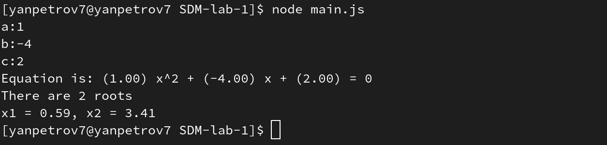

# SDM-lab-1
### Quadratic Equation Solver

The program takes three parameters as input: a, b, and c, which represent the coefficients of a quadratic equation in the form of ax^2 + bx + c = 0.

The user can input these parameters either in an interactive way by using the console or in a non-interactive way using a prepared text document.

### Interactive

### Non-interactive

## How to install
#### 1. Clone the repository on your device
```bash
git clone https://github.com/YanPetrov7/SDM-lab-1.git
```
#### 2. Move to your local repository
```bash
cd SDM-lab-1
```
#### 3. Install npm
```bash
npm install
```
## How to use
### You can use it in two different ways:
#### 1. Interactive
```bash
node main.js
```
#### 2. Non-interactive
```bash
node main.js yourfile
```
## File format description for non-interactive mode
- Program can use all text formats (tested with txt,md,xml and json).
- The program will work correctly if the input format is like this: `(a)\s(b)\s(c)\n` where (a),(b),(c) are values of coefficients. For example `1 -4 2`.
